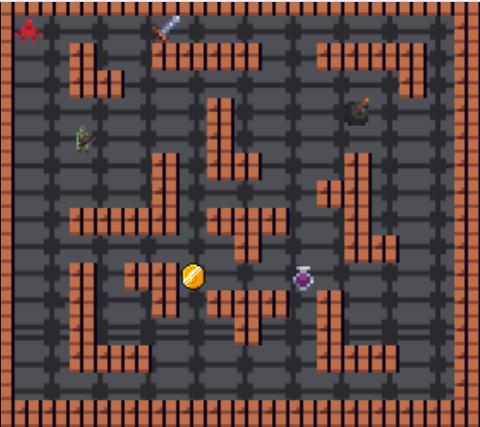

# Dungeonmania

## About

A 2D rougelike dungeon game developed to in the COMP2511 course at UNSW (Object-Oriented Programming) to demonstrate OOP design principles in Java.

    

## [Dungeonmania Design](./design.pdf)
